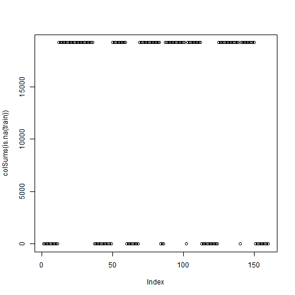
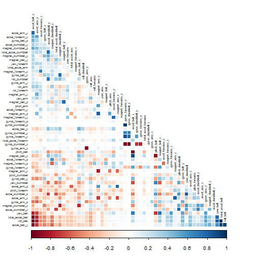
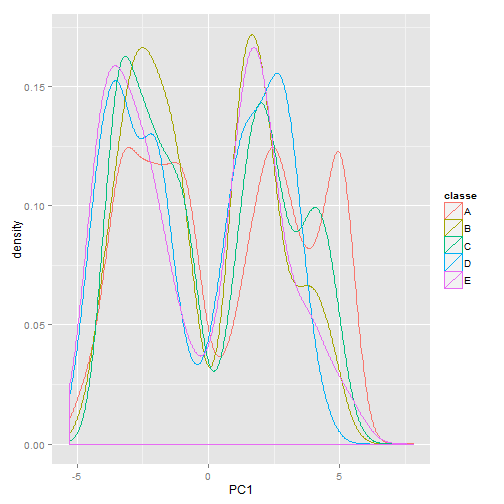
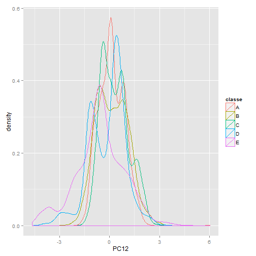
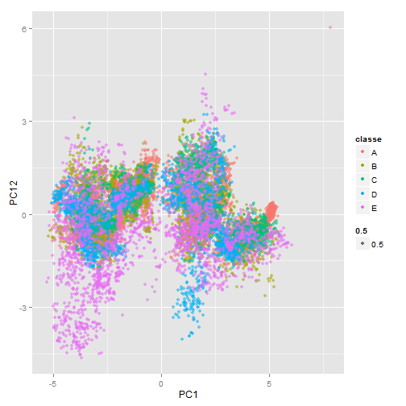

Predicting Characteristics of an Exercise Activity
========================================================

## Synopsis
The Quantified Self and Human activity recognition are recent trends in tracking and analyzing a person's day to day activities and movements to find patterns in behavior and potentially improve health.

To determine the patterns of performing barbell lifts in different manners, data from accelerometers on the belt, forearm, arm, and dumbell of 6 participants that performed barbell lifts correctly and incorrectly (intentionly) in 5 different ways were recorded. 

The goal of this project is to use this dataset to build a model capable of predicting how a dumbell lift exercise was performed based on the captured data.

Original data, additional information, and references can be found [here].

## Session Information

Load packages

```r
library(caret)
```

```
## Warning: package 'caret' was built under R version 3.1.1
```

```
## Loading required package: lattice
## Loading required package: ggplot2
```

```r
library(corrplot)
```

```
## Warning: package 'corrplot' was built under R version 3.1.1
```

Session info
Information about the current R session

```r
sessionInfo()
```

```
## R version 3.1.0 (2014-04-10)
## Platform: x86_64-w64-mingw32/x64 (64-bit)
## 
## locale:
## [1] LC_COLLATE=English_United States.1252 
## [2] LC_CTYPE=English_United States.1252   
## [3] LC_MONETARY=English_United States.1252
## [4] LC_NUMERIC=C                          
## [5] LC_TIME=English_United States.1252    
## 
## attached base packages:
## [1] stats     graphics  grDevices utils     datasets  methods   base     
## 
## other attached packages:
## [1] corrplot_0.73   caret_6.0-30    ggplot2_0.9.3.1 lattice_0.20-29
## [5] knitr_1.6      
## 
## loaded via a namespace (and not attached):
##  [1] BradleyTerry2_1.0-5 brglm_0.5-9         car_2.0-20         
##  [4] codetools_0.2-8     colorspace_1.2-4    digest_0.6.4       
##  [7] evaluate_0.5.5      foreach_1.4.2       formatR_0.10       
## [10] grid_3.1.0          gtable_0.1.2        gtools_3.4.1       
## [13] iterators_1.0.7     lme4_1.1-7          MASS_7.3-31        
## [16] Matrix_1.1-3        minqa_1.2.3         munsell_0.4.2      
## [19] nlme_3.1-117        nloptr_1.0.0        nnet_7.3-8         
## [22] plyr_1.8.1          proto_0.3-10        Rcpp_0.11.1        
## [25] reshape2_1.4        scales_0.2.4        splines_3.1.0      
## [28] stringr_0.6.2       tools_3.1.0
```

## Data Processing

Set working directory to intended folder  
Download file and read into dataframes **train** and **test**


```r
## downloading training file
urltrain<-"https://d396qusza40orc.cloudfront.net/predmachlearn/pml-training.csv"
if (!file.exists("./pmltrain.csv")){
    download.file(urltrain, destfile="./pmltrain.csv")
}

## downloading testing file
urltest<-"https://d396qusza40orc.cloudfront.net/predmachlearn/pml-testing.csv"
if (!file.exists("./pmltest.csv")){
    download.file(urltest, destfile="./pmltest.csv")
}

## read data into train and test dataframes
train <- read.csv("./pmltrain.csv", na.strings=c("?","","NA"))
test <- read.csv("./pmltest.csv", na.strings=c("?","","NA"))
```


### Cleaning data and exploratory data plotting


```r
## quick exploratory plot to view distribution of NAs in data
plot(colSums(is.na(train)))
```

 
This exploratory plot shows groups of variables that do not contain information. Based on this finding, these variables will be removed from further downstream processing and analyses.


```r
## subset data by removing columns with greater than 10000 NAs 
trainsub <- train[,-which(colSums(is.na(train))>10000)]

## Remove columns not providing exercise activity data
trainsub <- trainsub[,-(1:7)]

## Apply same subsetting criteria on test dataset
testsub <- test[,-which(colSums(is.na(test))>15)]
testsub <- testsub[,-(1:7)]
```


The cleaned-up training dataset **trainsub** will be further partitioned into: 
- model training dataset **fortrain** (70% of **trainsub** data)
- cross validation dataset **fortest** (30% of **trainsub** data)


```r
trainpart <- createDataPartition(y=trainsub$classe,p=0.7,list=FALSE)
fortrain <- trainsub[trainpart,]
fortest <- trainsub[-trainpart,]
```


## Building a Model

### Principle Components Analysis

Principle components analysis (PCA) is utilized to reveal the unapparent structures in data that best explains the variance in the data. PCA can reduce the dimensionality and decrease redundancy in a complex dataset for further downstream applications.  


```r
cm <- cor(fortrain[,-53])
corrplot(cm, method="color",type="lower",diag=FALSE,order="FPC",tl.cex=0.5,
         tl.col="grey35")
```

 
The above figure is a graphical display of a correlation matrix of the different variables in the dataset. The darker the blue the higher the positive correlations; the darker the red the higher the negative correlation. Near-white, light pink and blue colors demonstrate less or little correlation. 


```r
pre <- preProcess(fortrain[,-53],method="pca",thresh=0.99)

fortrainpca <- predict(pre, fortrain[,-53])
fortestpca <- predict(pre, fortest[,-53])
```
The data is preprocessed using the "pca" method. Remember to remove the "classe" variable (which is the variable we want to predict) out of the preprocessing dataset. This reduces the number of variables from 53 to 36. This will reduce dimensionality and redundancy for the next model training step.


### Random Forests

Based on the [characteristics of the random forest algorithm], the dataset was trained with the random forest method. 


```r
rfmodel <- train(fortrain$classe ~ .,method="rf",data=fortrainpca,
                 trControl=trainControl(method="cv",number=5),importance=TRUE)
```


The importance of the different principal component variables is shown in the following table.


```r
## This will show the principal components with the most importance
varImp(rfmodel)
```

```
## rf variable importance
## 
##   variables are sorted by maximum importance across the classes
##   only 20 most important variables shown (out of 36)
## 
##         A     B    C    D    E
## PC1  38.0 100.0 85.4 81.9 95.0
## PC12 63.8  86.4 85.8 66.9 58.1
## PC35 64.5  57.1 81.8 57.9 59.6
## PC8  27.9  45.0 56.4 71.5 41.7
## PC20 34.3  71.1 70.8 57.7 63.3
## PC13 28.5  69.5 61.3 58.4 61.3
## PC14 47.8  51.9 68.2 57.5 54.3
## PC15 47.6  67.3 58.3 49.1 58.8
## PC21 50.5  57.4 53.2 46.7 51.9
## PC18 25.1  47.7 57.4 46.1 43.7
## PC6  39.7  51.8 57.2 53.0 50.0
## PC5  46.9  55.7 55.3 54.0 53.0
## PC29 54.5  55.0 53.2 48.3 46.2
## PC2  35.3  47.5 40.5 51.1 36.3
## PC25 37.0  41.0 50.2 45.7 43.1
## PC27 26.9  49.3 47.1 35.1 45.5
## PC7  17.7  46.9 40.6 49.2 42.7
## PC24 12.3  48.2 40.6 30.7 40.5
## PC17 30.0  46.1 37.5 39.8 33.9
## PC36 21.1  41.3 45.2 36.8 25.1
```

```r
##varImpPlot(rfmodel$finalModel,sort=TRUE,cex=0.7)
```


The following exploratory plots show the distribution of data for the top two principal components. 


```r
## notes of some exploratory attempts
## head(pre)
## str(pre)

zquicktry <- predict(pre, fortrain[,-53])
zquicktry[,37] <- fortrain[,53]
colnames(zquicktry)[37] <- "classe"

## This will show the principal components with the most importance
varImp(rfmodel)
```

```
## rf variable importance
## 
##   variables are sorted by maximum importance across the classes
##   only 20 most important variables shown (out of 36)
## 
##         A     B    C    D    E
## PC1  38.0 100.0 85.4 81.9 95.0
## PC12 63.8  86.4 85.8 66.9 58.1
## PC35 64.5  57.1 81.8 57.9 59.6
## PC8  27.9  45.0 56.4 71.5 41.7
## PC20 34.3  71.1 70.8 57.7 63.3
## PC13 28.5  69.5 61.3 58.4 61.3
## PC14 47.8  51.9 68.2 57.5 54.3
## PC15 47.6  67.3 58.3 49.1 58.8
## PC21 50.5  57.4 53.2 46.7 51.9
## PC18 25.1  47.7 57.4 46.1 43.7
## PC6  39.7  51.8 57.2 53.0 50.0
## PC5  46.9  55.7 55.3 54.0 53.0
## PC29 54.5  55.0 53.2 48.3 46.2
## PC2  35.3  47.5 40.5 51.1 36.3
## PC25 37.0  41.0 50.2 45.7 43.1
## PC27 26.9  49.3 47.1 35.1 45.5
## PC7  17.7  46.9 40.6 49.2 42.7
## PC24 12.3  48.2 40.6 30.7 40.5
## PC17 30.0  46.1 37.5 39.8 33.9
## PC36 21.1  41.3 45.2 36.8 25.1
```

```r
## par(mfrow = c(1, 2))
qplot(PC1,colour=classe,data=zquicktry,geom="density")
```

 

```r
qplot(PC12,colour=classe,data=zquicktry,geom="density")
```

 

```r
qplot(PC1,PC12,colour=classe,data=zquicktry,alpha=0.5)
```

 


## Cross Validation and Out-of-sample Error

Cross validation testing was performed on the previously partitioned **fortest** dataset. The confusion matrix summarizes how the model predicted the "classe" variable in the validation dataset.


```r
predictfortest <- predict(rfmodel, fortestpca)

cfmatrix <- confusionMatrix(fortest$classe, predictfortest)

cfmatrix
```

```
## Confusion Matrix and Statistics
## 
##           Reference
## Prediction    A    B    C    D    E
##          A 1665    8    0    1    0
##          B   20 1110    8    1    0
##          C    0   18 1003    4    1
##          D    1    0   41  922    0
##          E    0    3   11    6 1062
## 
## Overall Statistics
##                                         
##                Accuracy : 0.979         
##                  95% CI : (0.975, 0.983)
##     No Information Rate : 0.286         
##     P-Value [Acc > NIR] : <2e-16        
##                                         
##                   Kappa : 0.974         
##  Mcnemar's Test P-Value : NA            
## 
## Statistics by Class:
## 
##                      Class: A Class: B Class: C Class: D Class: E
## Sensitivity             0.988    0.975    0.944    0.987    0.999
## Specificity             0.998    0.994    0.995    0.992    0.996
## Pos Pred Value          0.995    0.975    0.978    0.956    0.982
## Neg Pred Value          0.995    0.994    0.988    0.998    1.000
## Prevalence              0.286    0.194    0.181    0.159    0.181
## Detection Rate          0.283    0.189    0.170    0.157    0.180
## Detection Prevalence    0.284    0.194    0.174    0.164    0.184
## Balanced Accuracy       0.993    0.984    0.969    0.989    0.997
```

- The estimated accuracy is **0.9842**
- The estimated out of sample error is **1 - Accuracy = 0.0176**


## Prediction of Test Cases

The test dataset was processed and analyzed by the model described above. The predictions of the "classe" for each case is shown below.


```r
actualtest <- predict(pre,testsub[,-53])

predicttest<- predict(rfmodel,actualtest)

predicttest
```

```
##  [1] B A B A A E D B A A B C B A E E A B B B
## Levels: A B C D E
```


[here]:http://groupware.les.inf.puc-rio.br/har#dataset
[characteristics of the random forest algorithm]:http://en.wikipedia.org/wiki/Random_forest
